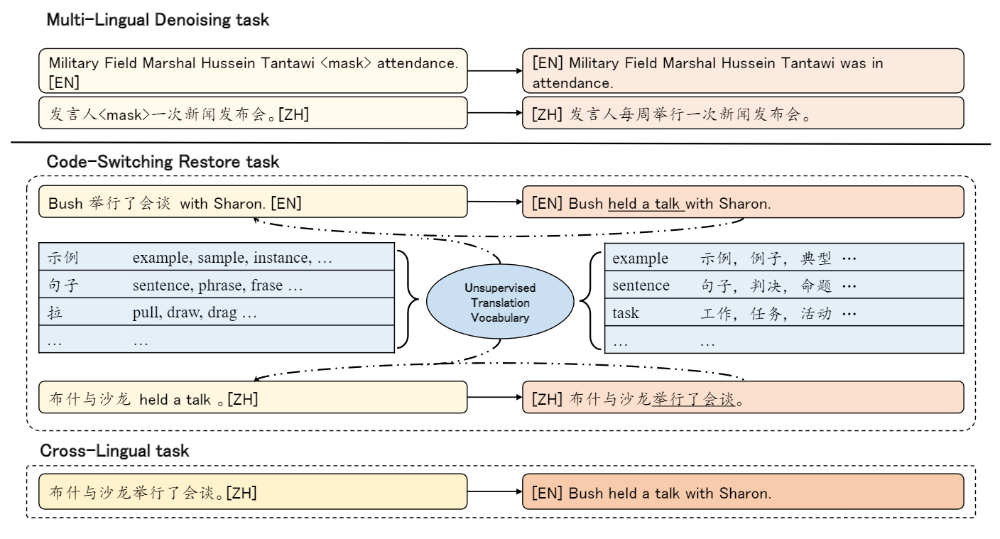

# CSR4mBART

Code of our paper [Bridging Cross-Lingual Gaps During Leveraging the Multilingual Sequence-to-Sequence Pretraining for Text Generation and Understanding](https://arxiv.org/abs/2204.07834)


> For multilingual sequence-to-sequence pretrained language models (multilingual Seq2Seq PLMs), e.g. mBART, the self-supervised pretraining task is trained on a wide range of monolingual languages, e.g. 25 languages from CommonCrawl, while the downstream cross-lingual tasks generally progress on a bilingual language subset, e.g. English-German, making there exists the data discrepancy, namely domain discrepancy, and cross-lingual learning objective discrepancy, namely task discrepancy, between the pretraining and finetuning stages. To bridge the above cross-lingual domain and task gaps, we extend the vanilla pretrain-finetune pipeline with an extra code-switching restore task. Specifically, the first stage employs the self-supervised code-switching restore task as a pretext task, allowing the multilingual Seq2Seq PLMs to acquire some in-domain alignment information. And for the second stage, we fine-tune the model on downstream data normally. Experiments on both NLG evaluation (12 bilingual translation tasks, 30 zero-shot translation tasks, and 2 cross-lingual summarization tasks) and NLU evaluation (7 cross-lingual natural language inference tasks) show our model outperforms the strong baseline mBART with standard finetuning strategy, consistently. Analyses indicate our approach could narrow the Euclidean distance of cross-lingual sentence representations, and improve the model generalization with trivial computational cost.



## Installation
- `bash setup.sh`

## Usage
**Example commands**

Extracting the unsupervised translation vocabulary from the downstream task data: 
- `bash scripts/extract_vocab.sh $SRC_LANG $TGT_LANG`

Training translation model with our two-stage fine-tuning method
- `bash scripts/train.sh`

## Data
- Bilingual Translation: 
The translation datasets are based on [ML50](https://github.com/facebookresearch/fairseq/tree/main/examples/multilingual/data_scripts) and [iwslt14](https://github.com/facebookresearch/fairseq/blob/main/examples/translation/prepare-iwslt14.sh).

- Cross-Lingual Summarization: 
The cross-lingual summarization datasets are based on [NCLS](https://github.com/ZNLP/NCLS-Corpora)

- XNLI: 
The XNLI dataset is based on [XGLUE](https://github.com/microsoft/XGLUE)

- Preprocess: 
We follow [mBART](https://github.com/pytorch/fairseq/blob/master/examples/mbart/README.md) to preprocess the data, including tokenization and binarization. 

## Evaluate

- `bash scripts/evaluate.sh $checkpoint ${SRC} ${TGT}`


```
@article{zan2022CSR4mBART,
  title={Bridging cross-lingual gaps during leveraging the multilingual sequence-to-sequence pretraining for text generation},
  author={Changtong Zan, Liang Ding, Li Shen, Yu Cao,   Weifeng Liu and Dacheng Tao},
  journal={arXiv preprint},
  year={2022}
}
```
